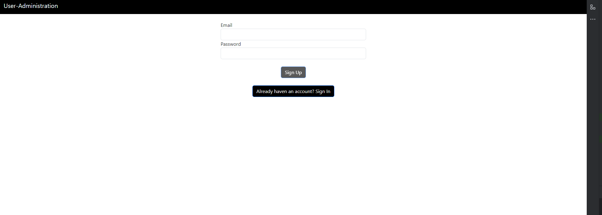
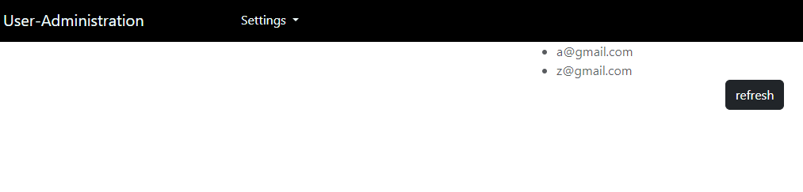
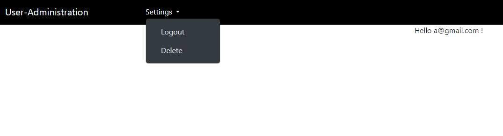

# UserAdministration

This is a personal project, which manages user in the firebase backend.

## Authentication

The user can either create an account or login, with filling the template driven form

## Roles

### Admin

the admins have an own panel, which allows them to list all normal users. The Admin are identified through a json-document in the backend

### Normal User

normal users only have a home pages, which greets them

## Auto Login/Logout

This program stores the current user in the browser, which enables an automatic login, which expires after his session has timed out

## Route Protection
This program ensures that routes are protected and that only specific user groups can view them

<h2> Other:</h2>

This project was generated with [Angular CLI](https://github.com/angular/angular-cli) version 16.1.1.

### Development server

Run `ng serve` for a dev server. Navigate to `http://localhost:4200/`. The application will automatically reload if you change any of the source files.

### Code scaffolding

Run `ng generate component component-name` to generate a new component. You can also use `ng generate directive|pipe|service|class|guard|interface|enum|module`.

### Build

Run `ng build` to build the project. The build artifacts will be stored in the `dist/` directory.

### Running unit tests

Run `ng test` to execute the unit tests via [Karma](https://karma-runner.github.io).

### Running end-to-end tests

Run `ng e2e` to execute the end-to-end tests via a platform of your choice. To use this command, you need to first add a package that implements end-to-end testing capabilities.

### Further help

To get more help on the Angular CLI use `ng help` or go check out the [Angular CLI Overview and Command Reference](https://angular.io/cli) page.
